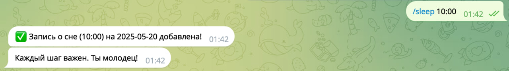
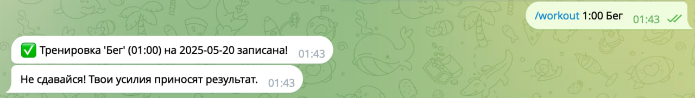

# Health Tracker Telegram Bot

Этот проект представляет собой Telegram-бота для отслеживания ваших показателей здоровья, таких как сон, потребленные калории и тренировки. Бот позволяет легко записывать данные, просматривать статистику за последнюю неделю в виде текста и графиков, получать мотивационные сообщения и даже советы на основе ваших данных с помощью интеграции с GigaChat.

## Особенности

* **Отслеживание сна:** Записывайте продолжительность вашего сна ежедневно.
* **Отслеживание калорий:** Вносите данные о потребленных калориях.
* **Отслеживание тренировок:** Регистрируйте время и тип ваших физических активностей.
* **Еженедельная статистика:** Получайте текстовый отчет о ваших показателях за последние 7 дней.
* **Графики:** Визуализируйте свои данные за неделю с помощью графиков сна, калорий и тренировок.
* **Советы от ИИ:** Получайте персонализированные рекомендации на основе ваших недельных данных (интеграция с GigaChat).
* **Мотивационные сообщения:** Поддерживайте свой настрой с помощью случайных мотивирующих цитат.
* **Хранение данных:** Все данные хранятся локально в базе данных SQLite.

## Файлы проекта

* `main.py`: Главный файл бота, инициализирует и запускает бота, регистрирует обработчики команд.
* `config.py`: Файл для хранения конфигурационных данных, таких как токен Telegram бота и учетные данные GigaChat. **Не забудьте заполнить его своими данными!**
* `handlers.py`: Содержит функции-обработчики для команд Telegram (например, `/start`, `/sleep`, `/calories`, `/workout`, `/stats`, `/plot`, `/advice`, `/motivation`, `/help`).
* `database.py`: Модуль для работы с базой данных SQLite. Отвечает за инициализацию базы, добавление записей и получение данных.
* `stats.py`: Функции для сбора и форматирования статистических данных за последнюю неделю.
* `plotting.py`: Модуль для генерации графиков статистики с использованием `matplotlib`.
* `gigachat_integration.py`: Интеграция с GigaChat API для получения советов на основе данных пользователя.
* `motivation.py`: Содержит список мотивационных сообщений и функцию для выбора случайного.

## Установка и запуск

1.  **Клонируйте репозиторий:**
    ```bash
    git clone <ссылка_на_ваш_репозиторий>
    cd health-bot
    ```

2.  **Установите зависимости:**
    ```bashpe
    pip install -r requirements.txt
    ```

3.  **Настройте конфигурацию:**
    * Создайте файл .env в директории telegram_tracker_bot/config, где укажите следующие ключи:
        ```python
        TELEGRAM_BOT_TOKEN = 'ваш_токен_телеграм_бота'
        GIGACHAT_CLIENT_ID = 'ваш_client_id_гигачат'
        GIGACHAT_CLIENT_SECRET = 'ваш_client_secret_гигачат'
        GIGACHAT_TOKEN_URL = 'ваш_токен_гигачат'
        GIGACHAT_AUTHORIZATION_KEY = 'ваш_ключ_авторизации_гигачат'
        DATABASE_NAME = "telegram_tracker_bot/db/tracker_data_base.db"
        ```

4.  **Запустите бота:**
    ```bash
    python main.py
## Использование

После запуска бота вы можете взаимодействовать с ним в Telegram, используя следующие команды:
* `/start`: Приветственное сообщение и краткая справка.
* 
* `/help`: Показывает список доступных команд.
* 
* `/sleep ЧАСЫ`: Записать продолжительность сна. Пример: `/sleep 8:15` или `/sleep 7.5`.
* 
* `/calories КОЛ-ВО`: Записать количество потребленных калорий. Пример: `/calories 1800`.
* 
* `/workout ЧАСЫ АКТИВНОСТЬ`: Записать тренировку. Пример: `/workout 1:30 Бег` или `/workout 0.75 Йога`.
* 
* `/stats`: Показать текстовую статистику за последние 7 дней.
* 
* `/plot`: Сгенерировать и отправить график статистики за последние 7 дней.
* 
* `/advice`: Получить совет от ИИ на основе ваших данных.
* 
* `/motivation`: Получить случайное мотивационное сообщение.
* 
